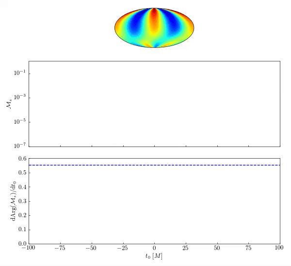

# Spatial Mapping

This repository contains the code used to produce the figures in Dyer & Moore (arXiv:2410.13935). 

  

*Figure 1: An animation of the reconstructed fundamental QNM at a range of t0 values. The derivative of the mismatch with respect to the start time is related to the real part of the QNM frequency (the blue dashed line).*

# Requirements & usage 

To use this code you will need to install [qnmfits](https://github.com/eliotfinch/qnmfits). 

This code uses NR waveforms from the Spectral Einstein Code. CCE waveforms can be obtained from the [SXS Gravitational Waveform Database](https://data.black-holes.org/waveforms/extcce_catalog.html). All simulations were transformed into the superrest frame using the [`scri`](https://pypi.org/project/scri/) package. This can be done using the `CCE_extract.py` code. 